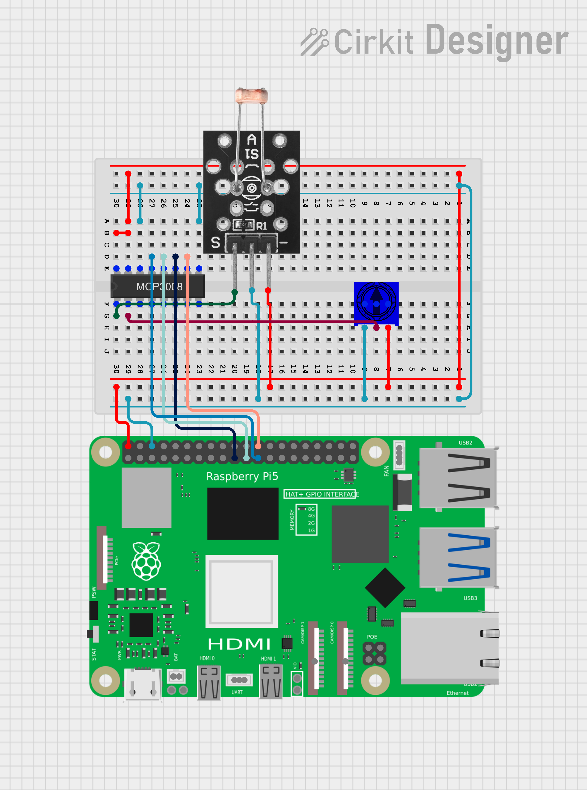

# RasPi A

## Role in the System  
Reads sensor values (LDR and potentiometer via MCP3208 ADC) and publishes them to the broker.  
- Publishes to `lightSensor` (LDR) and `threshold` (potentiometer).  
- Subscribes to these topics to detect changes compared to previous values.  
- Uses retained messages and last-will notifications for fault tolerance.  

## Venv Setup
```bash
# install venv
sudo apt install python3-venv -y

# create venv
python3 -m venv .venv

# start venv
source .venv/bin/activate

# install dependencies
pip install -r requirements.txt
```

## SPI Setup
```bash
# Open the firmware config file
sudo nano /boot/firmware/config.txt

# Scroll to the bottom and add this line:
dtoverlay=spi0-1cs

# Reboot
sudo reboot

# After reboot, check devices
ls /dev/spi*

# You should now see:
/dev/spidev0.0
```

## Circuit Diagram


## Parts List
* Raspberry Pi 5
* [MCP3208 ADC](https://ww1.microchip.com/downloads/aemDocuments/documents/APID/ProductDocuments/DataSheets/21298e.pdf)
* [KY-018 LDR](https://www.datasheethub.com/wp-content/uploads/2022/10/KY-018-Joy-IT.pdf)
* [TSR-3386 Potentiometer](https://cdn.sparkfun.com/assets/2/b/1/1/7/TSR-3386.pdf)

## Run Script
```bash
# source virtual environment
source .venv/bin/activate

# set broker ip environment variable
export MQTT_BROKER=<your-broker-ip>

# execute script
python3 raspiA.py
```