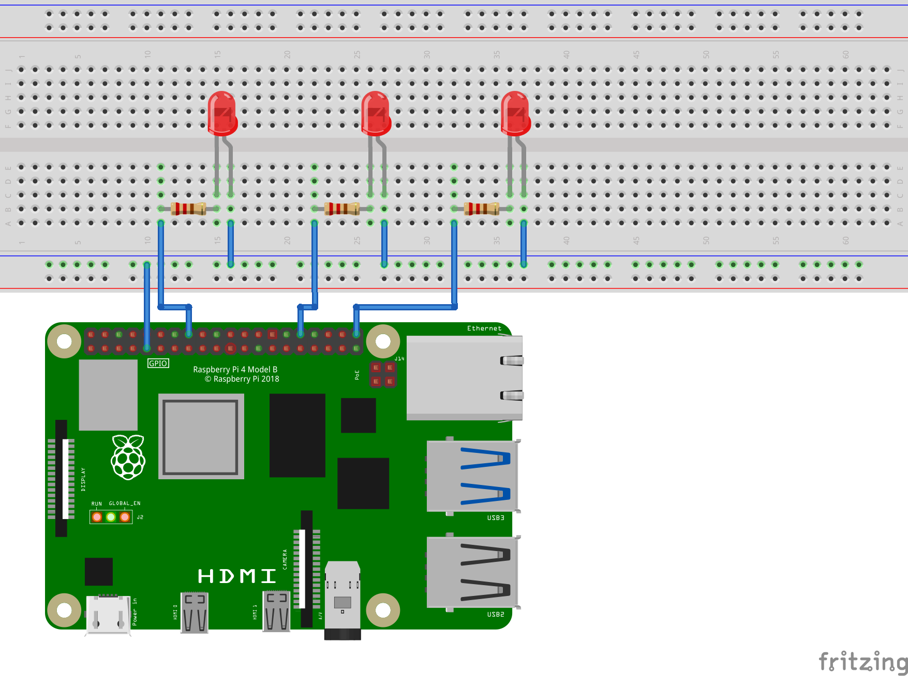

# RasPi B

## Role in the System  
Acts as the visual indicator for system state using onboard LEDs.  
- Subscribes to:
  - `LightStatus` (main LED control from RasPi C)  
  - `Status/RaspberryPiA` (online/offline status of RasPi A)  
  - `Status/RaspberryPiC` (online/offline status of RasPi C)  
- Drives 3 LEDs:  
  - **LED1** → Current LightStatus (on/off)  
  - **LED2** → RasPi A online/offline  
  - **LED3** → RasPi C online/offline 

## Venv Setup
```bash
# install venv
sudo apt install python3-venv -y

# create venv
python3 -m venv .venv

# start venv
source .venv/bin/activate

# install dependencies
pip install -r requirements.txt
```

## Run Script
```bash
# source virtual environment
source .venv/bin/activate

# set broker ip environment variable
export BROKER_HOST=<your-broker-ip>

# set broker port environment variable
export BROKER_PORT=<your-broker-ip>

# execute script
python3 pi_b.py
```

## Expected Output

When the program starts, you should see:
```
Starting Raspberry Pi B client...
Message ready to receive!
```

The program will wait for MQTT messages. Initially, all LEDs should be OFF.

## Wiring Diagram

- Feel free to use any GPIO pins for your LEDs.
- For our code, we used GPIO 16, 20, 21.

## Parts list
- Raspberry Pi (4+)
- 3 LEDs
- 3 220 ohms resistors (any resistor will do)

## Testing the Code

### Installation
Have mosquitto-clients installed on your raspberry pi:
```bash
sudo apt-get install mosquitto-clients
```

### Test Setup
Run the code on one terminal:
```bash
# Terminal 1
python3 pi_b.py
```

### Test Commands

Open another terminal and test different scenarios:

#### 1. Test Raspberry Pi A Status
```bash
# Terminal 2 - Make Pi A online
mosquitto_pub -h localhost -t "Status/RaspberryPiA" -m "online" -r

# Expected output: LED2 turns ON
# Console: "Raspberry Pi A is online - LED2 on"

# Make Pi A offline
mosquitto_pub -h localhost -t "Status/RaspberryPiA" -m "offline" -r

# Expected output: LED2 turns OFF
# Console: "Raspberry Pi A is offline - LED2 off"
```

#### 2. Test Raspberry Pi C Status
```bash
# Make Pi C online
mosquitto_pub -h localhost -t "Status/RaspberryPiC" -m "online" -r

# Expected output: LED3 turns ON
# Console: "Raspberry Pi C is online - LED3 on"
#          "No LightStatus message available - LED1 off"

# Make Pi C offline
mosquitto_pub -h localhost -t "Status/RaspberryPiC" -m "offline" -r

# Expected output: LED1 and LED3 turn OFF
# Console: "Raspberry Pi C is offline - LED1 and LED3 off"
```

#### 3. Test Light Status (Pi C must be online first!)
```bash
# IMPORTANT: Pi C must be online for light commands to work
mosquitto_pub -h localhost -t "Status/RaspberryPiC" -m "online" -r

# Turn light on
mosquitto_pub -h localhost -t "LightStatus" -m "TurnOn"

# Expected output: LED1 turns ON (only if Pi C is online)
# Console: "Light is on - LED1 on"

# Turn light off
mosquitto_pub -h localhost -t "LightStatus" -m "TurnOff"

# Expected output: LED1 turns OFF
# Console: "Light is off - LED1 off"

# Try light command when Pi C is offline
mosquitto_pub -h localhost -t "Status/RaspberryPiC" -m "offline" -r
mosquitto_pub -h localhost -t "LightStatus" -m "TurnOn"

# Expected output: LED1 stays OFF
# Console: "LightStatus message received but C is offline - LED1 off"
```

### Complete Test Sequence
```bash
# 1. Start with everything online
mosquitto_pub -h localhost -t "Status/RaspberryPiA" -m "online" -r
mosquitto_pub -h localhost -t "Status/RaspberryPiC" -m "online" -r

# Expected: LED2 and LED3 are ON, LED1 is OFF (no light command yet)

# 2. Send light command
mosquitto_pub -h localhost -t "LightStatus" -m "TurnOn"

# Expected: All LEDs are ON

# 3. Take Pi C offline
mosquitto_pub -h localhost -t "Status/RaspberryPiC" -m "offline" -r

# Expected: LED1 and LED3 are OFF, LED2 stays ON

# 4. Bring Pi C back online
mosquitto_pub -h localhost -t "Status/RaspberryPiC" -m "online" -r

# Expected: LED1 and LED3 turn ON (remembers last light command)
```

## Important Notes

### MQTT Message Retention
- **Status messages are RETAINED** (`-r` flag): When Pi B starts, it immediately receives the last known status of Pi A and Pi C
- **Light commands are NOT RETAINED**: Old light commands won't replay when Pi B restarts

### LED Behavior Logic
- **LED1 (Light Status)**: Only works when Pi C is online AND a light command is received
- **LED2 (Pi A Status)**: Directly follows Pi A's online/offline status
- **LED3 (Pi C Status)**: Directly follows Pi C's online/offline status

### Troubleshooting

#### If LEDs behave unexpectedly after restart:
- Check if your MQTT broker has retained messages
- To see all retained messages: `mosquitto_sub -h localhost -t "#" -v`

#### If you accidentally retained LightStatus messages:
This will cause old light commands to replay every time Pi B starts. To fix this:

```bash
# Clear the retained LightStatus message
mosquitto_pub -h localhost -t "LightStatus" -r -m ""

# Or use null message
mosquitto_pub -h localhost -t "LightStatus" -r -n
```

**How to tell if LightStatus is retained:**
- Pi B receives LightStatus message immediately upon starting (before any new commands)
- LED1 behavior happens right at startup instead of waiting for fresh commands

#### Clear all retained messages (nuclear option):
```bash
# Clear all status and light messages
mosquitto_pub -h localhost -t "Status/RaspberryPiA" -r -m ""
mosquitto_pub -h localhost -t "Status/RaspberryPiC" -r -m ""
mosquitto_pub -h localhost -t "LightStatus" -r -m ""
```

#### Other common issues:
- If light commands don't work, ensure Pi C is online first
- If LEDs don't turn on/off, check GPIO connections.
- If LEDs don't turn on/off, check if Pi B is connected to the internet as well as Pi A and Pi C.

### Expected Console Output Example
```
Starting Raspberry Pi B client...
Message ready to receive!
Received message on topic Status/RaspberryPiA: online
Raspberry Pi A is online - LED2 on
Received message on topic Status/RaspberryPiC: online
Raspberry Pi C is online - LED3 on
No LightStatus message available - LED1 off
Received message on topic LightStatus: TurnOn
Light is on - LED1 on
```


